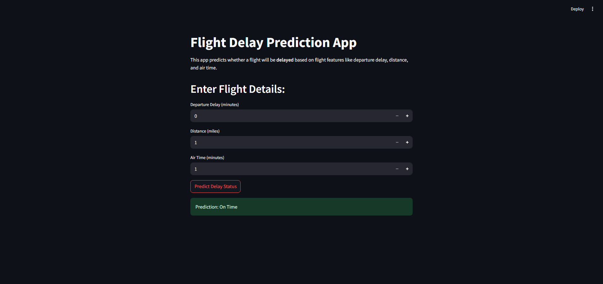

# Flight Delay Prediction Project

This project explores flight delay patterns and builds a model to predict whether a flight will arrive on time or not, using a 3 million row dataset from the U.S. Department of Transportation (2019–2023). Now deployed with a simple interactive app built with Streamlit.

> **Note:** Due to GitHub's file size restrictions, the raw dataset (`flights_sample_3m.csv`) is not included in this repository. Please download it manually from the source.

## Dataset
- Source: [Kaggle - Flight Delay and Cancellation Dataset (2019–2023)](https://www.kaggle.com/datasets/patrickz/flight-delay-and-cancellation-2019-2023)
- Size: 3,000,000 rows
- Features include: flight date, airline, origin/destination airports, scheduled and actual times, delays, cancellations, and delay causes.

## Exploratory Data Analysis
- Checked for missing values
- Visualized average delays by airline and airport
- Explored cancellation rates and causes
- Identified most important features for delay prediction

## Modeling 
- Logistic Regression and Random Forest classifiers
- Target variable: **On Time vs Delayed** (e.g. `ARR_DELAY` ≥ 15 min = Delayed)
- Accuracy, precision, recall evaluation

## Tools Used
- Python, Pandas, Matplotlib, Seaborn, Streamlit
- Scikit-learn
- Jupyter Notebook

## Results
- Logistic Regression Accuracy: ~93.7%
- Random Forest (after tuning) Accuracy: ~93.8%
- Key feature influencing delays: Departure Delay (DEP_DELAY)

## Streamlit App Preview
Below is a preview of the interactive web app built with Streamlit:

---

